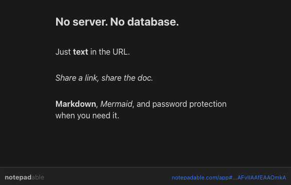

# <strong>notepad</strong><span style="opacity:0.5;font-weight:400">able</span>

A minimalist text editor that encodes your entire document into the URL. No server, no database, no accounts -- just share a link and the recipient gets your full text.



Built with TypeScript, CodeMirror 6, and a custom hybrid compression pipeline that squeezes roughly 2x more text into a URL than standard deflate + base64.

---

## Branding & UI

The logo uses a two-part treatment: **notepad** in full weight, **able** muted:

```html
<span class="nav-name">
  <strong>notepad</strong>
  <span class="nav-name-muted">able</span>
</span>
```

```css
.nav-name {
  font-size: 2rem;
  font-weight: 600;
  letter-spacing: -0.01em;
}

.nav-name strong { font-weight: 600; }

.nav-name-muted {
  font-weight: 400;
  opacity: 0.5;
}
```

### Design tokens

| Token | Light | Dark |
|-------|-------|------|
| `--bg` | `#f5f5f5` | `#1a1a1a` |
| `--text` | `#1a1a1a` | `#e0e0e0` |
| `--accent` | `#1a6ef5` | `#3b82f6` |
| `--radius` | `12px` | `12px` |

### Key UI elements

**Primary button:**
```html
<a href="/app" class="btn btn-primary">Open editor</a>
```

**Demo window** (inverts theme: light page = dark card, dark page = light card):
```html
<div class="demo-window">
  <div class="demo-content">
    <div class="demo-text">Your text here...</div>
  </div>
  <div class="demo-bar">
    <span class="demo-bar-brand">notepad<span class="demo-bar-faint">able</span></span>
    <a class="demo-bar-url" href="/app#">notepadable.com/app#</a>
  </div>
</div>
```

**Nav structure:**
```html
<nav class="nav">
  <a href="/" class="nav-brand">
    <span class="nav-name"><strong>notepad</strong><span class="nav-name-muted">able</span></span>
  </a>
  <div class="nav-actions">
    <a href="/docs" class="btn btn-ghost">Docs</a>
    <a href="/app" class="btn btn-outline">Open editor</a>
  </div>
</nav>
```

---

## How it works

Everything you type is compressed and stored in the URL hash fragment (`#`). The hash never hits the server -- the static HTML/JS decompresses it client-side. This means:

- Share a link and the recipient sees exactly what you wrote
- Your text never touches a server
- Works offline as a PWA
- Deploy anywhere that serves static files

## Compression

The app uses a hybrid compression pipeline:

1. **Dictionary encoding** -- The 4,096 most common English words (from [Google's Trillion Word Corpus](https://github.com/first20hours/google-10000-english)) are mapped to 12-bit indices. Since these words cover ~95% of typical English prose, most of your text compresses dramatically before general-purpose compression even begins.

2. **lz-string** -- The dictionary-encoded binary output is further compressed with [lz-string](https://github.com/pieroxy/lz-string), which is optimized for short strings and URL-safe output.

The result: roughly 600-1,200 words fit in a 2,000-character URL (the universal safe limit for sharing across platforms).

## Encryption

Documents can be shared with a password. Click the share button and select the **Encrypted** tab to set a password before copying the link. The recipient is prompted to enter the password when they open the link.

The encryption is entirely client-side using the browser's built-in [Web Crypto API](https://developer.mozilla.org/en-US/docs/Web/API/Web_Crypto_API):

- **AES-256-GCM** -- authenticated encryption. A wrong password doesn't produce garbled output; the decryption simply fails, so there's no way to partially read the content.
- **PBKDF2** -- the password is never used directly as a key. It's run through 100,000 iterations of PBKDF2 (SHA-256) with a random salt to derive the actual AES key. This makes brute-force attacks ~10ms per guess on modern hardware.
- **Random salt + IV** -- a new 16-byte salt and 12-byte initialization vector are generated for every encryption, so the same text encrypted with the same password produces a different ciphertext each time.

The encrypted payload is stored in the URL hash, same as unencrypted documents. The server never sees the password or the plaintext.

> Note: without a backend there is no rate limiting, so the strength of the encryption depends on the strength of the password. A short or common password is vulnerable to offline brute-force attacks.

## Development

```bash
npm install
npm run dev
```

## Build

```bash
npm run build
```

Output goes to `dist/`. Deploy that folder to Vercel, Netlify, Cloudflare Pages, or any static host. The `readme-image.png` in the project root is documentation-only and is not included in the build.

## Inspired by

[textarea.my](https://github.com/antonmedv/textarea) by Anton Medvedev -- a beautifully simple text editor that stores content in the URL hash. This project takes the same core idea and rebuilds it with better compression and a modern editor.

---

Made by [Bicrick](https://github.com/bicrick) · [bicrick.com](https://bicrick.com)
