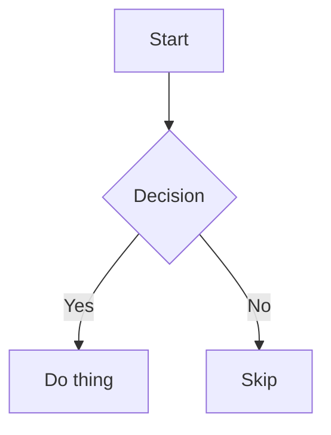

# notepadable

A minimalist text editor that encodes your entire document into the URL. No server, no database, no accounts.

---

## What it's good for

notepadable is built around one idea: the URL *is* the document. There is no backend storing your text. Everything lives in the hash fragment at the end of the URL.

| Use case | Description |
|----------|-------------|
| **Instant sharing** | Write something, copy the URL, send it. The recipient sees exactly what you wrote — no accounts, no uploads, no expiry date. |
| **Bookmarkable notes** | Save a notepadable URL to your bookmarks and the text travels with it. The note is as durable as the bookmark. |
| **Ephemeral pastes** | Snippets, draft messages, quick reference text. Nothing lingers on a server because nothing ever reaches one. |
| **Scripting & automation** | Use the [`/raw` API](#the-raw-api) to pull the plain text of any notepadable link directly into a shell script or CI pipeline. |

## How it works

When you type in the editor, your text is compressed and written to the URL hash. The compression runs entirely in the browser — no round-trip to a server at any point.

### Compression pipeline

Text is compressed in two stages before it reaches the URL:

1. **Dictionary encoding.** A built-in dictionary of 4,096 common English words maps each matching word to a 12-bit index. Typical English prose compresses significantly in this step alone. Title-cased variants get a dedicated token so they round-trip without loss.

2. **LZ compression.** The dictionary-encoded binary payload is then run through [lz-string](https://github.com/pieroxy/lz-string)'s `compressToEncodedURIComponent`, which produces a compact, URL-safe string with no characters that need percent-encoding.

The final string is placed directly after `#` in the URL.

### URL storage

The compressed text lives in the **URL hash fragment** — the part after `#`. Hash fragments are never sent to the server by the browser, so your text stays entirely on the client. notepadable's servers never see it.

As a fallback, the last hash is also cached in `localStorage` so the editor restores your content even if you navigate to `/app` without a hash.

### Limits

There is no hard server-side limit on URL length, but practical limits exist:

- Most browsers handle URLs up to ~64KB comfortably.
- Many link-sharing platforms (Slack, Twitter, etc.) truncate or refuse very long URLs. A practical safe limit is roughly **10–14 KB of source text** after compression.
- The `localStorage` fallback has the same constraint.

## The /raw API

Any notepadable link can be turned into a plain-text endpoint. Take the hash that normally follows `/app#` and pass it as a path segment to `/raw/`. The server decompresses it and responds with `Content-Type: text/plain`.

This is a genuine server-side endpoint — curl-able, script-friendly, and returns raw text with no HTML wrapper.

### Plain text

For a link like `notepadable.com/app#IAAAgQi...`, the raw equivalent is:

**Request:**
```bash
curl notepadable.com/raw/IAAAgQi...
```

**Response:**
```
Your plain text content here.
```

### Encrypted documents

If the document is password-protected, pass the password as a `?p=` query parameter:

**Request:**
```bash
curl "notepadable.com/raw/IAAAgQi...?p=yourpassword"
```

If you omit `?p=` on an encrypted document, the API returns a `401` with a message telling you to supply the password. A wrong password also returns `401`.

> **Warning:** Passwords passed as query parameters may appear in server logs and browser history. For sensitive content, prefer decrypting in the browser via the editor.

## Encryption

Documents can be password-protected from the editor toolbar. The encryption happens entirely in the browser before the text touches the URL.

- **Algorithm:** AES-256-GCM via the Web Crypto API.
- **Key derivation:** PBKDF2 with 100,000 iterations and SHA-256, salted with 16 random bytes per encryption.
- **IV:** 12 random bytes generated fresh for every encryption.

The salt and IV are stored alongside the ciphertext in the URL hash. The password is never stored or transmitted — it exists only in your browser's memory while the tab is open.

> Lose the password and the document is unrecoverable. There is no reset mechanism.

## Markdown & Mermaid

The editor includes a preview mode that renders your text as Markdown using [marked](https://marked.js.org). Toggle preview from the toolbar or with the keyboard shortcut.

[Mermaid](https://mermaid.js.org) diagrams are supported in preview mode. Wrap your diagram in a fenced code block tagged `mermaid`:



Mermaid is loaded on demand from a CDN when the preview is first opened, so it does not add to the initial page weight.
