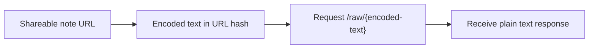

# Raw endpoint

Every `notepadable` link can also be read as plain text.

Take the encoded part after `#`, send it to `/raw/...`, and the server will return the decompressed note as `text/plain`.



## Try it

```bash
curl https://notepadable.com/raw/IAAAASAuAgYCQAWBIIQAEASACAMwGoDoA7AGIDqAFJACAGwBqAbgB4AMAYICGA-ANIAsAIUA
```