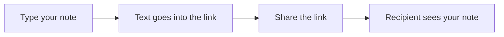

# notepadable

A simple text editor that lives in your browser. No sign-up, no accounts, no data stored on any server.

https://notepadable.com/app#IAAAgQiACQQg2wbILsEwA6AMAmhgGglAAwEFiAFEAEAACoA4AJICAABAVAAmBIYABgAOAJCC60AuAC3WIXFxABQIZQD7YAOgAEFiAB9rCAA8uACwCwhAKIAQkAHpaAPABslXCyYAPuQAIABYIB4AFlaEAAiVgBgAA25AD9CAFMAQfIANQBwgHEsgHAADhQARYBPAB8AWgBOgF6igFTkgFCARKaASIBGgDSmNAsDAAoyAEUUFEoQUyEQANomADuAGAAUFYAtFgAVAFUQAEp8uSZ-YBQAYPq2DQBHFgApLUiAKtZgIxAAdW9rSIB30JMJjESI7ABKABkwAA0DQgABQrDoAAi5JF+BYACMaACuADcAGEAN8+ADNPoMuJQ2DVkvUqgA56QACDkADFCIINFknGlPkcmAAnTkgADsoQAXKwANqDACMAAcRgBLYAjLYQFAAUqKTO0AAk5AAumbyQH6AAZAE4RiNcitKABCyYAYU5wFytACADHKCwyAA94xyECcyIKsArKAOABUrFyGDkwG8XIA6U4CWoAGRpaFZ72yEAcrFwkC0FjRNAAHBTGgyorUaT5ADL+SGU8A0LRgAAwaReShiIoASaaAE36p09TJ21yAKw7QQcRUqtVbJg1FOUZ6Xa53R7aAB-bw+3y53VJfyzADW1Fk2WlDZQUFUtQBYycAM8oaGIIEi3CUAAhHOTTDgAtS0NRIEa0jBsBjr1K0WpVAAuQyrgsJ8AAXEAAIYgCA-ggAAFeoWhMAATKwEpPkBLRak0qGjgArdOgFiHO9TDixTRagwSxoBs2x7IIFpcJEWy+AApxYAAiVZkAASFYGjMgANqESmsFWAAdaIplQtBcFmP5-pQrLAFwIpLOaLBiXIzIigAzaEAB8gnCbsIBZoaVCcj2ADmu63A8WjeHoBpcEwYgYjYEC0MyABe-Y8GEMxqLQKAEp5Kxsmyf7yMG-5CJEMYAEFNPIvA1cQcBYGgCC4OsWDeEBZAXt6fx4hmagAORPlwcr3D2KwsH+ID6vCAA7IASsRmVQLkAB0SxGiw6zrGUf65LpM1fCmPYADPdt6LLsoQADRjpyZQcIAN7lVA0LdAA+VowAwEwADtBxHIRHYoOVy1NBoH0wPCG1bX+XDRDNACkACS9RvlqyRavSABLwKUAAzokiS46EAB6Om6RK2EAMqRJEIBkFsChCJ2iUOKwmP-YoggqLQ8LXtI2FyAAJTMZZQJQpI-isQA

## What it does

- **Share by link** — Type your text, copy the URL, and send it. Whoever opens the link sees exactly what you wrote.
- **Fits a lot in the link** — Even long notes (hundreds of words) fit into a shareable link. The app squeezes the text so it travels in the URL.
- **Preview mode** — See your text formatted nicely. Use Markdown for headings, lists, and links. Add simple diagrams with Mermaid.
- **Password lock** — Protect a note with a password. Only someone with the password can read it.
- **Light or dark** — Pick a theme, or let it follow your device.

## How it works

Your text never leaves your browser until you share the link.
