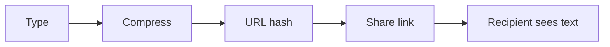

# notepadable

A *minimalist* text editor that stores everything in the URL hash. No server, no accounts.

https://notepadable.com

## Features

- **Compression** — Dictionary + lz-string. ~600–1,200 words in a 2,000-character URL.
- **URL hash** — Share a link; the recipient gets your full text. Copy the URL and the text travels with it.
- **Markdown & Mermaid** — Preview mode with inline diagrams. Use fenced code blocks tagged `mermaid`.
- **Encryption** — Optional password protection. AES-256-GCM, client-side only.
- **Theme** — Light, dark, or system preference.

## At a glance

Two-stage compression: dictionary encoding (4,096 words) then lz-string. Hash fragments never hit the server.

*Made with JavaScript*
